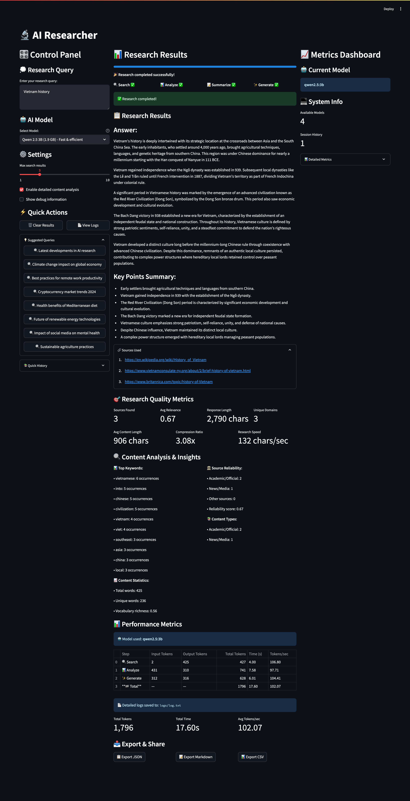

# AI Researcher

A comprehensive AI-powered research assistant that combines web search, content analysis, and intelligent summarization to provide detailed research results. Built with Deepseek, LangGraph, and Streamlit, with real-time performance tracking, multiple AI model support, and advanced profiling.

## Key Features

- 🔍 **Advanced Web Search** - Intelligent search across multiple sources using Tavily API
- 📊 **Content Analysis & Summarization** - AI-powered content processing and insights
- ⚡ **Performance Tracking** - Real-time metrics and optimization monitoring
- 🤖 **Multiple AI Models** - Support for Deepseek, Qwen, Gemma, Magistral and bring-your-own ollama models
- 📈 **Metrics Dashboard** - Comprehensive performance and quality analytics
- 📚 **Research History** - Track and revisit previous searches with detailed comparisons
- 🎨 **Modern UI** - Three-column layout with control panel, results, and metrics
- 📤 **Export Capabilities** - Export results in JSON, Markdown, and CSV formats
- 🔧 **Debug Information** - Detailed logging and debugging tools


## Pre-requisites

Install Ollama on your local machine from the [official website](https://ollama.com/). And then pull the Deepseek model:

```bash
ollama pull deepseek-r1:8b
```

Other models can be used: 

- `magistral`
- `phi4-mini-reasoning`
- `qwen3:8b`

Create a virtual environment and install the dependencies:

```bash
python3 -m venv .venv
source .venv/bin/activate
pip install -r requirements.txt
```

## Environment Variables

Copy the sample environment file and configure your API keys:

```bash
cp sample-dot-env .env
```

Edit the `.env` file and add your Tavily API key. You can get a free API key from [Tavily](https://tavily.com/):

```bash
TAVILY_API_KEY=your_tavily_api_key_here
```

## Deactivate Virtual Environment

When you're done working, you can exit the virtual environment:

```bash
deactivate
```

## Run

Run the Streamlit app:

```bash
streamlit run ai_researcher.py
```

## Screenshots



