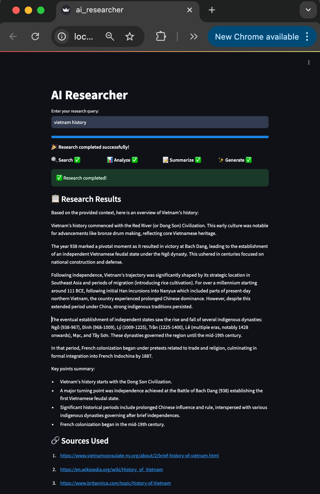

# AI Researcher

A simple AI Agent using Deepseek, LangGraph, and Streamlit to find results from the web that matches the user's query and give a summarized answer based on those results.


## Pre-requisites

Install Ollama on your local machine from the [official website](https://ollama.com/). And then pull the Deepseek model:

```bash
ollama pull deepseek-r1:8b
```

Create a virtual environment and install the dependencies:

```bash
python3 -m venv .venv
source .venv/bin/activate
pip install -r requirements.txt
```

## Environment Variables

Copy the sample environment file and configure your API keys:

```bash
cp sample-dot-env .env
```

Edit the `.env` file and add your Tavily API key. You can get a free API key from [Tavily](https://tavily.com/):

```bash
TAVILY_API_KEY=your_tavily_api_key_here
```

## Deactivate Virtual Environment

When you're done working, you can exit the virtual environment:

```bash
deactivate
```

## Run

Run the Streamlit app:

```bash
streamlit run ai_researcher.py
```

## Screenshots

