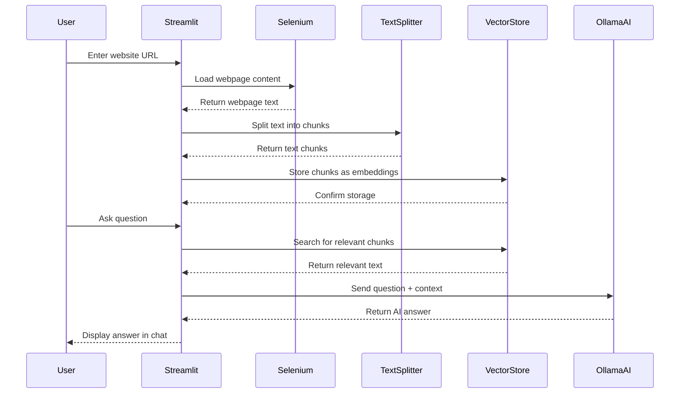

# AI Scraper - Complete Guide for Beginners

## 🎯 What is this Application?

This is an **AI-powered web scraper and question-answering system** that allows you to:
1. Input any website URL
2. Automatically extract and process the website content
3. Ask questions about the content in natural language
4. Get AI-generated answers based on the website's information

Think of it as having a smart assistant that can read any website and answer your questions about it!

## 🚀 Main Features

### 1. **Web Scraping**
- Automatically visits any website URL you provide
- Extracts all text content from the webpage
- Handles dynamic content (JavaScript-rendered pages)

### 2. **Intelligent Text Processing**
- Splits large documents into manageable chunks
- Maintains context between chunks with overlapping text
- Optimizes text for AI processing

### 3. **Smart Search & Retrieval**
- Converts text to AI-understandable format (embeddings)
- Finds the most relevant content for any question
- Uses similarity search to match questions with relevant text

### 4. **AI-Powered Q&A**
- Natural language question processing
- Context-aware answers based on website content
- Concise, accurate responses (max 3 sentences)

### 5. **User-Friendly Interface**
- Web-based interface using Streamlit
- Chat-like interaction
- Real-time question and answer display

## 📚 Libraries Used

### **Core Framework**
- **Streamlit** (`streamlit`): Creates the web interface
  - Makes it easy to build web apps with Python
  - Provides input widgets, chat interface, and display components

### **Web Scraping**
- **SeleniumURLLoader** (`langchain_community.document_loaders`): 
  - Visits websites and extracts content
  - Handles JavaScript-rendered pages
  - Automates web browser interactions

### **Text Processing**
- **RecursiveCharacterTextSplitter** (`langchain_text_splitters`):
  - Splits large documents into smaller chunks
  - Maintains context with overlapping text
  - Optimizes chunk size for AI processing

### **AI & Machine Learning**
- **OllamaEmbeddings** (`langchain_ollama`):
  - Converts text to numerical vectors (embeddings)
  - Enables similarity search between texts
  - Uses the Llama 3.2 model for text understanding

- **OllamaLLM** (`langchain_ollama.llms`):
  - The actual AI model that generates answers
  - Uses Llama 3.2 for natural language processing
  - Runs locally on your machine via Ollama

### **Vector Database**
- **InMemoryVectorStore** (`langchain_core.vectorstores`):
  - Stores document embeddings in memory
  - Enables fast similarity search
  - Temporary storage (data is lost when app restarts)

### **Prompt Engineering**
- **ChatPromptTemplate** (`langchain_core.prompts`):
  - Creates structured prompts for the AI
  - Ensures consistent answer format
  - Provides instructions to the AI model

## 🔄 How It Works - Sequence Diagram



## 🧠 Key AI Concepts Explained

### **1. Embeddings**
- **What**: Converting text into numbers (vectors) that AI can understand
- **Why**: AI models work with numbers, not words
- **Example**: "Hello" → [0.1, -0.3, 0.8, ...] (hundreds of numbers)
- **Benefit**: Can compare similarity between different texts

### **2. Vector Store**
- **What**: A database that stores text embeddings for fast searching
- **Why**: Enables finding similar documents quickly
- **How**: When you ask a question, it finds the most similar stored texts
- **Benefit**: Much faster than reading through all documents

### **3. Text Chunking**
- **What**: Breaking large documents into smaller pieces
- **Why**: AI models have limits on how much text they can process
- **Strategy**: 1000 characters per chunk with 200 character overlap
- **Benefit**: Maintains context while staying within AI limits

### **4. Similarity Search**
- **What**: Finding the most relevant text for a given question
- **How**: Compares question embedding with stored document embeddings
- **Result**: Returns the most similar document chunks
- **Benefit**: Provides relevant context for accurate answers

### **5. Prompt Engineering**
- **What**: Designing how to ask the AI questions
- **Why**: Better prompts = better answers
- **Template**: Provides instructions, question, and context
- **Benefit**: Consistent, high-quality responses

## 🔧 Technical Architecture

```
┌─────────────────┐    ┌─────────────────┐    ┌─────────────────┐
│   User Input    │    │  Web Scraping   │    │ Text Processing │
│                 │    │                 │    │                 │
│ • URL           │───▶│ • Selenium      │───▶│ • Text Splitter │
│ • Questions     │    │ • Loader        │    │ • Chunking      │
└─────────────────┘    └─────────────────┘    └─────────────────┘
                                                        │
┌─────────────────┐    ┌─────────────────┐    ┌─────────────────┐
│   User Output   │    │   AI Response   │    │ Vector Storage  │
│                 │    │                 │    │                 │
│ • Chat Display  │◀───│ • Ollama LLM    │◀───│ • Embeddings    │
│ • Answers       │    │ • Prompt Chain  │    │ • Similarity    │
└─────────────────┘    └─────────────────┘    └─────────────────┘
```

## 🎓 Learning Path for Beginners

### **Step 1: Understand the Basics**
1. Learn about web scraping and HTTP requests
2. Understand text processing and natural language
3. Study basic AI/ML concepts (embeddings, vectors)

### **Step 2: Explore the Libraries**
1. **Streamlit**: Build simple web apps
2. **Selenium**: Automate web browser interactions
3. **LangChain**: Work with AI models and document processing
4. **Ollama**: Run AI models locally

### **Step 3: Practice Projects**
1. Build a simple web scraper
2. Create a basic chatbot
3. Implement text similarity search
4. Combine all concepts in a Q&A system

### **Step 4: Advanced Topics**
1. Vector databases (Pinecone, Weaviate)
2. Advanced prompt engineering
3. Fine-tuning AI models
4. Production deployment

## 🚨 Common Issues & Solutions

### **1. Ollama Not Running**
- **Problem**: "Connection refused" errors
- **Solution**: Start Ollama service and ensure Llama 3.2 model is installed

### **2. Web Scraping Fails**
- **Problem**: Can't load certain websites
- **Solution**: Some sites block automated access; consider using different loaders

### **3. Memory Issues**
- **Problem**: App crashes with large websites
- **Solution**: Reduce chunk size or use persistent vector storage

### **4. Slow Performance**
- **Problem**: Takes too long to process
- **Solution**: Optimize chunk size, use faster embeddings model

## 🔮 Future Enhancements

### **Possible Improvements**
1. **Persistent Storage**: Use database instead of in-memory storage
2. **Multiple URLs**: Process multiple websites at once
3. **File Upload**: Support PDF, DOCX, TXT files
4. **User Authentication**: Multi-user support
5. **Answer History**: Save and retrieve previous Q&A sessions
6. **Export Features**: Download processed data and answers

### **Advanced Features**
1. **Real-time Updates**: Monitor website changes
2. **Multi-language Support**: Process content in different languages
3. **Image Analysis**: Extract and analyze images from websites
4. **API Integration**: Connect with external data sources
5. **Custom Models**: Fine-tune AI for specific domains

## 📖 Additional Resources

### **Documentation**
- [Streamlit Documentation](https://docs.streamlit.io/)
- [LangChain Documentation](https://python.langchain.com/)
- [Ollama Documentation](https://ollama.ai/docs)
- [Selenium Documentation](https://selenium-python.readthedocs.io/)

### **Tutorials**
- [Building AI Applications with LangChain](https://python.langchain.com/docs/tutorials/)
- [Streamlit App Development](https://docs.streamlit.io/knowledge-base/tutorials)
- [Web Scraping with Python](https://realpython.com/python-web-scraping-practical-introduction/)

### **Concepts to Study**
- Natural Language Processing (NLP)
- Vector Databases and Embeddings
- Large Language Models (LLMs)
- Web Scraping and Automation
- Prompt Engineering
- Retrieval-Augmented Generation (RAG)

---

*This guide is designed to help beginners understand the AI scraper application. Feel free to experiment with the code and explore the concepts further!* 