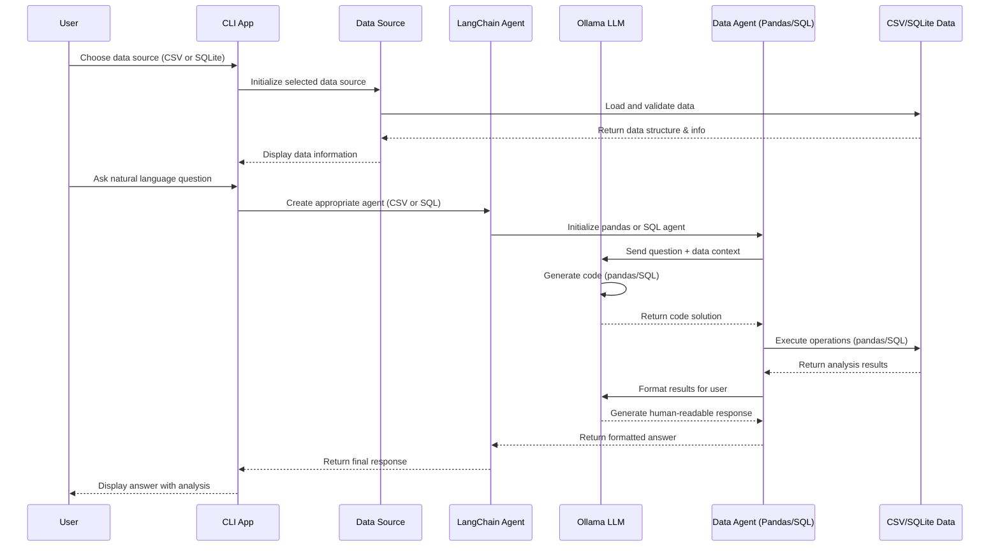

# Chat with Data using Ollama and LangChain

A Python application that allows you to have natural language conversations with your data using Ollama and LangChain. Supports both CSV files and SQLite databases. Available in both command-line and web interface versions.

## Features

- Chat with your data using natural language
- **Multiple Data Sources Support**:
  - **CSV Files** - Analyze CSV data with pandas
  - **SQLite Databases** - Query SQLite databases with SQL agent
- Powered by Ollama for local LLM inference
- Built with LangChain for intelligent data analysis
- Available in two versions:
  - **Command-line interface** (`cli-chat-with-data.py`) - Interactive terminal-based interface with data source selection
  - **Web interface** (`app-chat-with-data.py`) - Modern Streamlit web app with GUI
- Runs completely locally - no data sent to external APIs
- File upload support (Streamlit version)
- Smart sample prompts based on your data structure
- Interactive data preview and exploration

## How it Works

This application creates an intelligent data analysis pipeline that combines the power of large language models with data manipulation capabilities. The system now supports both CSV files (using pandas) and SQLite databases (using SQL agents). Here's how the system processes your questions and generates insights:



### Key Components

1. **Data Source Abstraction**: The application uses a flexible data source system that supports:
   - **CSV Files**: Loaded into pandas DataFrames for analysis
   - **SQLite Databases**: Connected via SQLAlchemy for SQL operations

2. **LangChain Integration**: Uses different LangChain agents based on data source:
   - **Pandas DataFrame Agent**: For CSV data analysis with Python/pandas operations
   - **SQL Agent**: For SQLite database queries with natural language to SQL conversion

3. **Ollama LLM**: The local language model (Mistral, Llama2, etc.) interprets your questions and generates appropriate code:
   - **Pandas operations** for CSV data analysis
   - **SQL queries** for database analysis

4. **Safe Execution**: Generated code is executed in controlled environments:
   - **Pandas operations** run against DataFrame objects
   - **SQL queries** execute with read-only permissions

5. **Response Generation**: The LLM formats the results into human-readable responses, providing both the answer and context about how it was derived.

### Security & Privacy

- **Local Processing**: All data processing happens on your machine - no data is sent to external APIs
- **Controlled Execution**:
  - **CSV Mode**: Pandas operations run in a sandboxed environment
  - **SQLite Mode**: SQL queries are executed with appropriate safety measures
- **Transparent Operations**: You can see the generated code (pandas/SQL) in debug mode to understand exactly what operations are being performed

## Prerequisites

Before setting up the project, make sure you have:

1. **Python 3.8+** installed on your system
2. **Ollama** installed and running
   - Install from: <https://ollama.ai/>
   - Pull a model (e.g., `ollama pull mistral`)

## Setup Instructions

### 1. Clone or Download the Project

```bash
# If you have the project in a git repository
git clone https://github.com/vuhung16au/ollama-playground/
cd chat-with-csv

# Or if you downloaded the files, navigate to the project directory
cd ollama-playground/chat-with-csv
```

### 2. Create Python Virtual Environment

Create a virtual environment named `.venv`:

```bash
# Create virtual environment
python3 -m venv .venv
```

### 3. Activate Virtual Environment

**On macOS/Linux:**

```bash
source .venv/bin/activate
```

**On Windows:**

```bash
.venv\Scripts\activate
```

You should see `(.venv)` in your terminal prompt, indicating the virtual environment is active.

### 4. Install Dependencies

Install the required Python packages:

```bash
pip install -r requirements.txt
```

### 5. Prepare Your Data

The application supports two types of data sources:

**Option A: CSV File**
Place your CSV file in the `data/` directory. The application includes a sample file `data/OnlineRetail.csv`.

**Option B: SQLite Database**
Place your SQLite database file in the `data/` directory. You can use the included `convert_csv_to_sqlite.py` script to convert CSV files to SQLite format:

```bash
python convert_csv_to_sqlite.py
```

### 6. Start Ollama Server

Make sure Ollama is running and you have pulled the required model:

```bash
# Start Ollama (if not already running)
ollama serve

# In another terminal, pull the mistral model (or your preferred model)
ollama pull mistral
```

## Usage

### Option 1: Command-Line Version (cli-chat-with-data.py)

#### Running the Application

With your virtual environment activated:

```bash
python cli-chat-with-data.py
```

#### Data Source Selection

When you run the application, you'll be prompted to choose your data source:

```text
📊 Available Data Sources:
1. CSV File (OnlineRetail.csv)
2. SQLite Database (OnlineRetail.db)
----------------------------------------
Please choose a data source (1 or 2): 
```

#### Example Interaction

**CSV Data Source:**

```text
🚀 Starting Data Chat with Ollama (mistral) 🚀
--------------------------------------------------
Successfully loaded CSV 'data/OnlineRetail.csv' with 541909 rows and 8 columns.
DataFrame columns: InvoiceNo, StockCode, Description, Quantity, InvoiceDate, UnitPrice, CustomerID, Country
--------------------------------------------------

Your question (or 'exit'/'quit'): What are the top 5 best-selling products?
```

**SQLite Data Source:**

```text
🚀 Starting Data Chat with Ollama (mistral) 🚀
--------------------------------------------------
Successfully loaded SQLite database 'data/OnlineRetail.db'
  Table 'OnlineRetail': 541909 rows, columns: InvoiceNo, StockCode, Description, Quantity, InvoiceDate, UnitPrice, CustomerID, Country
--------------------------------------------------

Your question (or 'exit'/'quit'): Show me the total sales by country using SQL
```

### Option 2: Streamlit Web Interface (app-chat-with-data.py)

#### For Developers: Installation

If you're setting up the development environment, follow the setup instructions above, then install Streamlit:

```bash
# Activate your virtual environment first
source .venv/bin/activate  # On macOS/Linux
# or
.venv\Scripts\activate     # On Windows

# Install all dependencies (including Streamlit)
pip install -r requirements.txt
```

#### For Users: Running the Web App

1. **Start Ollama server** (in one terminal):

   ```bash
   ollama serve
   ```

2. **Pull your desired model** (in another terminal):

   ```bash
   ollama pull mistral
   ```

3. **Launch the Streamlit app**:

   ```bash
   streamlit run app-chat-with-data.py
   ```

4. **Open your browser** to the URL shown (typically `http://localhost:8501`)

#### Streamlit App Features

**🎨 Modern Web Interface:**

- Clean, intuitive design with responsive layout
- Sidebar configuration panel
- Real-time status indicators

**📁 Flexible Data Loading:**

- Drag-and-drop CSV file upload
- One-click sample data loading (OnlineRetail.csv)
- Automatic data preview and structure analysis

**💡 Smart Sample Prompts:**

- Automatically generated prompts based on your data columns
- Generic prompts that work with any dataset
- Dataset-specific prompts (e.g., for retail data)
- Click-to-use prompt buttons

**🤖 Model Configuration:**

- Select from multiple Ollama models (mistral, llama2, codellama, gemma)
- Real-time model switching
- Setup instructions in the sidebar

**💬 Enhanced Chat Experience:**

- Beautiful chat history display
- Copy-paste friendly responses
- Clear chat functionality
- Error handling with helpful suggestions

### Sample Questions You Can Ask

**For CSV Data:**

- "What are the top 5 best-selling products?"
- "Show me the total revenue by country"
- "What's the average order value?"
- "How many unique customers do we have?"
- "What are the sales trends over time?"
- "Which products have the highest unit price?"

**For SQLite Data:**

- "SELECT the top 10 customers by total purchase amount"
- "What's the monthly sales trend?"
- "Show me all products with unit price above 10"
- "How many orders were placed each month?"
- "What's the average quantity per invoice?"
- "Find customers who made more than 5 purchases"

## Project Structure

```text
chat-with-data/
├── cli-chat-with-data.py   # Command-line version with data source selection
├── app-chat-with-data.py   # Streamlit web interface version
├── convert_csv_to_sqlite.py # Utility to convert CSV to SQLite
├── requirements.txt        # Python dependencies (includes Streamlit)
├── README.md              # This file
├── .venv/                 # Virtual environment (created during setup)
├── data/                  # Data directory
│   ├── OnlineRetail.csv   # Sample CSV dataset
│   └── OnlineRetail.db    # Sample SQLite database
└── chat-with-data.png     # Screenshot
```

## Configuration

### Changing the Model

**Command-line version:**
To use a different Ollama model, modify the `model_name` parameter in the `chat_with_data()` function call at the bottom of `cli-chat-with-data.py`:

```python
if __name__ == "__main__":
    # Choose data source interactively
    try:
        data_source = choose_data_source()
        # Run the chat function with different model
        chat_with_data(data_source, model_name="llama2")  # Change model here
    except KeyboardInterrupt:
        print("\nExiting. Goodbye!")
```

**Streamlit version:**
Simply select a different model from the dropdown in the sidebar. The app will reinitialize with the new model automatically.

### Using Different Data Files

**Command-line version:**
The application will automatically look for data files in the `data/` directory:

- **CSV**: Place your CSV file in `data/` directory and update the file path in the `CSVDataSource` initialization
- **SQLite**: Place your SQLite database file in `data/` directory and update the file path in the `SQLiteDataSource` initialization

You can modify the file paths in the `choose_data_source()` function in `cli-chat-with-data.py`:

```python
def choose_data_source():
    # ...existing code...
    if choice == "1":
        return CSVDataSource("data/your-file.csv")  # Update CSV path
    elif choice == "2":
        return SQLiteDataSource("data/your-database.db")  # Update SQLite path
```

**Streamlit version:**
Use the file uploader in the web interface to select any CSV file from your computer.

## Troubleshooting

### Common Issues

1. **"Ollama not found" error**
   - Ensure Ollama is installed and running (`ollama serve`)
   - Verify the model is pulled (`ollama pull mistral`)

2. **Data file not found (Command-line version)**
   - Check that your data files are in the `data/` directory
   - For CSV: Ensure `data/OnlineRetail.csv` exists
   - For SQLite: Ensure `data/OnlineRetail.db` exists
   - Use `convert_csv_to_sqlite.py` to create SQLite database from CSV

3. **Module import errors**
   - Ensure virtual environment is activated
   - Re-run `pip install -r requirements.txt`

4. **Permission errors with dangerous code**
   - The script uses `allow_dangerous_code=True` for pandas operations
   - This is necessary for the agent to execute data analysis code
   - SQLite operations are executed with appropriate safety measures

5. **Streamlit app won't start**
   - Check if port 8501 is already in use
   - Try running: `streamlit run app-chat-with-data.py --server.port 8502`

6. **File upload issues in Streamlit**
   - Ensure your CSV file is properly formatted
   - Check that the file size is reasonable (< 200MB recommended)
   - Try refreshing the page if upload seems stuck

### Performance Tips

- **For large datasets**:
  - **CSV**: Consider using a subset of your data for faster processing
  - **SQLite**: Use indexed columns and optimized queries for better performance
- **Model selection**: Smaller models (like mistral) are faster but may be less accurate
- **Streamlit performance**: Clear chat history periodically to maintain responsiveness

### Getting Help

If you encounter issues:

1. Check that all prerequisites are installed
2. Ensure your virtual environment is activated
3. Verify Ollama is running and the model is available
4. Check the error messages for specific guidance
5. For Streamlit issues, check the terminal output for detailed error messages

## Deactivating Virtual Environment

When you're done working with the project:

```bash
deactivate
```

This will return you to your system's default Python environment.

## Security Note

This application executes code generated by the LLM to analyze your data. While it runs locally and doesn't send data externally, be cautious when using it with sensitive data. The application uses:

- `allow_dangerous_code=True` for pandas operations (required for DataFrame agent functionality)
- Controlled SQL execution for SQLite operations
- Local processing only - no external API calls

Use responsibly with sensitive data.

## Quick Start Guide

### For End Users (Recommended: Streamlit Version)

1. **Install Ollama**: Download from [ollama.ai](https://ollama.ai/)
2. **Start Ollama**: `ollama serve`
3. **Pull a model**: `ollama pull mistral`
4. **Clone/download this project**
5. **Install dependencies**: `pip install -r requirements.txt`
6. **Run the app**: `streamlit run app-chat-with-data.py`
7. **Open browser**: Go to `http://localhost:8501`
8. **Upload your CSV** and start chatting!

### For Developers (Command-line Version)

1. Follow setup instructions above
2. **Run**: `python cli-chat-with-data.py`
3. **Choose your data source** (CSV or SQLite)
4. **Start chatting** with your data
5. **Modify** the script to point to your data files

## Screenshots


