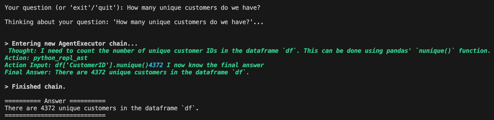

# Chat with Data using Ollama and LangChain

A Python application that allows you to have natural language conversations with your CSV data using Ollama and LangChain.

## Features

- 🤖 Chat with your CSV data using natural language
- 🚀 Powered by Ollama for local LLM inference
- 📊 Built with LangChain and Pandas for data analysis
- 💬 Interactive command-line interface
- 🔒 Runs completely locally - no data sent to external APIs

## Prerequisites

Before setting up the project, make sure you have:

1. **Python 3.8+** installed on your system
2. **Ollama** installed and running
   - Install from: <https://ollama.ai/>
   - Pull a model (e.g., `ollama pull mistral`)

## Setup Instructions

### 1. Clone or Download the Project

```bash
# If you have the project in a git repository
git clone <repository-url>
cd chat-with-csv

# Or if you downloaded the files, navigate to the project directory
cd path/to/chat-with-csv
```

### 2. Create Python Virtual Environment

Create a virtual environment named `.venv`:

```bash
# Create virtual environment
python3 -m venv .venv
```

### 3. Activate Virtual Environment

**On macOS/Linux:**

```bash
source .venv/bin/activate
```

**On Windows:**

```bash
.venv\Scripts\activate
```

You should see `(.venv)` in your terminal prompt, indicating the virtual environment is active.

### 4. Install Dependencies

Install the required Python packages:

```bash
pip install -r requirements.txt
```

### 5. Prepare Your CSV File

Place your CSV file in the project directory. By default, the script looks for `OnlineRetail.csv`, but you can modify the `csv_file` variable in `chat-with-data.py` to point to your specific file.

### 6. Start Ollama Server

Make sure Ollama is running and you have pulled the required model:

```bash
# Start Ollama (if not already running)
ollama serve

# In another terminal, pull the mistral model (or your preferred model)
ollama pull mistral
```

## Usage

### Running the Application

With your virtual environment activated:

```bash
python chat-with-data.py
```

### Example Interaction

```text
🚀 Starting CSV Chat with Ollama (mistral) 🚀
--------------------------------------------------
Successfully loaded 'OnlineRetail.csv' with 541909 rows and 8 columns.
DataFrame head:
   InvoiceNo StockCode                          Description  Quantity InvoiceDate   UnitPrice  CustomerID         Country
0     536365    85123A   WHITE HANGING HEART T-LIGHT HOLDER         6  2010-12-01        2.55     17850.0  United Kingdom
1     536365     71053                  WHITE METAL LANTERN         6  2010-12-01        3.39     17850.0  United Kingdom
2     536365    84406B       CREAM CUPID HEARTS COAT HANGER         8  2010-12-01        2.75     17850.0  United Kingdom
...

Your question (or 'exit'/'quit'): What are the top 5 best-selling products?
```

### Sample Questions You Can Ask

- "What are the top 5 best-selling products?"
- "Show me the total revenue by country"
- "What's the average order value?"
- "How many unique customers do we have?"
- "What are the sales trends over time?"
- "Which products have the highest unit price?"

## Project Structure

```text
chat-with-csv/
├── chat-with-data.py    # Main application script
├── requirements.txt     # Python dependencies
├── README.md           # This file
├── .venv/              # Virtual environment (created during setup)
└── your-data.csv       # Your CSV file
```

## Configuration

### Changing the Model

To use a different Ollama model, modify the `model_name` parameter in the `chat_with_csv()` function call at the bottom of `chat-with-data.py`:

```python
if __name__ == "__main__":
    csv_file = "your-file.csv"
    chat_with_csv(csv_file, model_name="llama2")  # Change model here
```

### Using a Different CSV File

Update the `csv_file` variable in the main section:

```python
if __name__ == "__main__":
    csv_file = "path/to/your/file.csv"  # Update this path
    chat_with_csv(csv_file, model_name="mistral")
```

## Troubleshooting

### Common Issues

1. **"Ollama not found" error**
   - Ensure Ollama is installed and running (`ollama serve`)
   - Verify the model is pulled (`ollama pull mistral`)

2. **CSV file not found**
   - Check the file path in the script
   - Ensure the CSV file is in the correct directory

3. **Module import errors**
   - Ensure virtual environment is activated
   - Re-run `pip install -r requirements.txt`

4. **Permission errors with dangerous code**
   - The script uses `allow_dangerous_code=True` for pandas operations
   - This is necessary for the agent to execute data analysis code

### Getting Help

If you encounter issues:

1. Check that all prerequisites are installed
2. Ensure your virtual environment is activated
3. Verify Ollama is running and the model is available
4. Check the error messages for specific guidance

## Deactivating Virtual Environment

When you're done working with the project:

```bash
deactivate
```

This will return you to your system's default Python environment.

## Security Note

This application executes code generated by the LLM to analyze your data. While it runs locally and doesn't send data externally, be cautious when using it with sensitive data. The `allow_dangerous_code=True` parameter is required for the pandas agent to function but should be used responsibly.

## Screenshots

