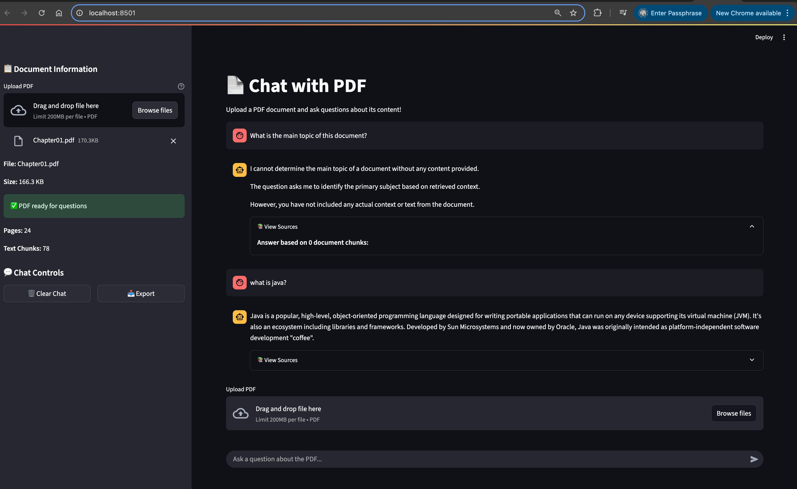

# Chat with PDF 📄💬

A simple yet powerful RAG (Retrieval-Augmented Generation) system using **Deepseek**, **LangChain**, and **Streamlit** to chat with PDFs and answer complex questions about your local documents.

🎥 **Watch the build process**: You can see how this was built on [YouTube](https://youtu.be/M6vZ6b75p9k).

## ✨ Features

- 📤 **Upload PDFs**: Easily upload and process PDF documents
- 🔍 **Smart Search**: Uses vector embeddings for intelligent document retrieval
- 💬 **Natural Conversations**: Ask questions in natural language about your documents
- 🚀 **Local Processing**: Runs entirely on your local machine with Ollama
- 📊 **Streamlit UI**: Clean and intuitive web interface

## 🛠️ Setup Instructions

### 1. Install Ollama

Install Ollama on your local machine from the [official website](https://ollama.com/).

### 2. Pull the Deepseek Model

```bash
ollama pull deepseek-r1:14b
# Alternative: For faster performance on less powerful machines
ollama pull deepseek-r1:8b
```

### 3. Python Environment Setup

**Prerequisites**: Make sure you have Python 3.8+ installed on your system.

#### Option A: Using Python Virtual Environment (Recommended)

1. **Clone or download this repository**:
   ```bash
   git clone <repository-url>
   cd chat-with-pdf
   ```

2. **Create a virtual environment**:
   ```bash
   python3 -m venv venv
   ```

3. **Activate the virtual environment**:
   - On macOS/Linux:
     ```bash
     source venv/bin/activate
     ```
   - On Windows:
     ```bash
     venv\Scripts\activate
     ```

4. **Install dependencies**:
   ```bash
   pip install -r requirements.txt
   ```

#### Option B: Using conda (Alternative)

```bash
conda create -n chat-pdf python=3.9
conda activate chat-pdf
pip install -r requirements.txt
```

### 4. Verify Installation

Make sure all dependencies are installed correctly:

```bash
pip list
```

You should see all the packages from `requirements.txt` listed.

## 🚀 Running the Application

### 1. Start the Application

Make sure your virtual environment is activated, then run:

```bash
streamlit run pdf_rag.py
```

The application will start and automatically open in your default browser at `http://localhost:8501`.

### 2. Upload Your PDFs

- Use the file uploader in the web interface to upload your PDF documents
- The application will process and index the documents automatically
- You'll see progress indicators during the upload and processing

### 3. Start Chatting

- Type your questions in the chat input field
- The system will search through your uploaded documents
- Receive AI-generated answers based on the document content
- Each response includes the source context for transparency

## 📊 Logging and Monitoring

The application includes comprehensive logging to help you monitor its performance and troubleshoot issues:

### Log File Location

- **File**: `pdf_rag.log` (created in the project directory)
- **Format**: Timestamp - Log Level - Message
- **Levels**: INFO, ERROR, WARNING, DEBUG

### What's Logged

- PDF upload and processing status
- Document loading and chunking operations
- Vector store operations
- Query processing and retrieval
- Error messages and stack traces

### Viewing Logs

You can monitor the logs in real-time:

```bash
# View the log file
cat pdf_rag.log

# Follow logs in real-time (macOS/Linux)
tail -f pdf_rag.log
```

### Log Example

```text
2025-06-25 10:30:15,123 - INFO - Starting upload_pdf function for file: Chapter01.pdf
2025-06-25 10:30:15,456 - INFO - Successfully uploaded PDF: Chapter01.pdf
2025-06-25 10:30:16,789 - INFO - PDF loaded successfully: pdfs/Chapter01.pdf
```

## 🔧 Troubleshooting

### Common Issues

1. **Ollama not found**
   - Make sure Ollama is installed and running
   - Verify with: `ollama --version`

2. **Model not available**
   - Ensure you've pulled the model: `ollama pull deepseek-r1:14b`
   - Check available models: `ollama list`

3. **Python dependency issues**
   - Make sure your virtual environment is activated
   - Try reinstalling: `pip install -r requirements.txt --upgrade`

4. **PDF processing errors**
   - Check the log file for detailed error messages
   - Ensure your PDF is not password-protected or corrupted

5. **Port already in use**
   - If port 8501 is busy, specify a different port:
     ```bash
     streamlit run pdf_rag.py --server.port 8502
     ```

## 📁 Project Structure

```text
chat-with-pdf/
├── pdf_rag.py          # Main Streamlit application
├── requirements.txt    # Python dependencies
├── README.md          # This file
├── prompt.md          # Prompt templates (if any)
├── pdf_rag.log        # Application logs
└── pdfs/              # Directory for uploaded PDFs
    └── Chapter01.pdf  # Sample PDF
```

## 🔧 Dependencies

- **streamlit**: Web interface framework
- **langchain_core**: Core LangChain functionality
- **langchain_community**: Community extensions for LangChain
- **langchain_ollama**: Ollama integration for LangChain
- **pdfplumber**: PDF text extraction

## 📝 How It Works

1. **Document Loading**: PDFs are loaded and text is extracted using PDFPlumber
2. **Text Splitting**: Documents are split into manageable chunks for processing
3. **Vector Embeddings**: Text chunks are converted to embeddings using Deepseek model
4. **Vector Storage**: Embeddings are stored in an in-memory vector database
5. **Retrieval**: When you ask a question, relevant chunks are retrieved based on similarity
6. **Generation**: The Deepseek model generates answers using the retrieved context

## 🤝 Contributing

Feel free to submit issues and enhancement requests!

## 📄 License

This project is open source and available under the [MIT License](LICENSE).

# Screenshots

