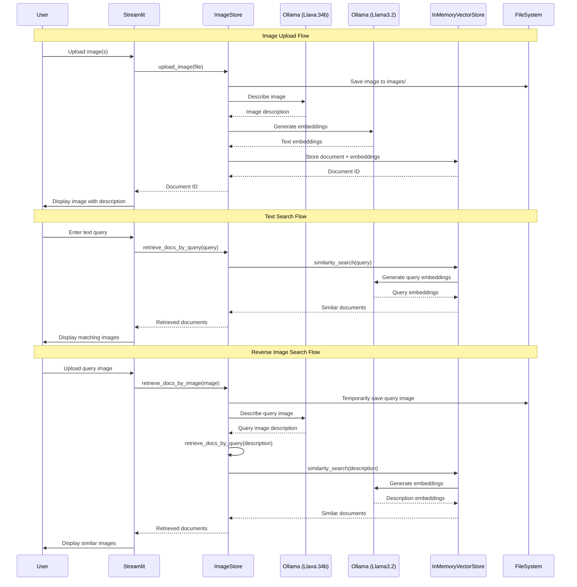

# Implementation Logic

This document explains the implementation details of the Image Search application, a local image search engine built with Ollama, LangChain, and Streamlit.

## Used Libraries

### Core Dependencies
- **Streamlit**: Web application framework for creating the user interface
- **LangChain Core**: Provides core abstractions for document handling and vector operations
- **LangChain Community**: Community extensions for LangChain
- **LangChain Ollama**: Integration between LangChain and Ollama for embeddings
- **Ollama**: Local LLM runtime for running vision and language models

### Models Used
- **Llava:34b**: Vision-language model for image description generation
- **Llama3.2**: Language model for text embeddings and similarity search

## Folder/File Structure

```
image-search/
├── app.py                 # Main Streamlit application entry point
├── image_store.py         # Core logic for image storage and retrieval
├── upload_images.py       # Page for uploading and processing images
├── image_search.py        # Page for text-based image search
├── reverse_search.py      # Page for reverse image search
├── requirements.txt       # Python dependencies
├── README.md             # Project documentation
├── LOGIC.md              # Implementation logic (this file)
├── images/               # Directory for storing uploaded images
│   └── *.jpg/png/jpeg    # Uploaded image files
└── __pycache__/          # Python cache files
```

### File Descriptions

#### `app.py`
- Main entry point for the Streamlit application
- Defines navigation between three pages using `st.navigation()`
- Creates a multi-page application structure

#### `image_store.py`
- Core business logic class (`ImageStore`)
- Manages image storage, description generation, and retrieval
- Uses in-memory vector store for similarity search
- Handles both text queries and reverse image search

#### `upload_images.py`
- Streamlit page for image upload functionality
- Accepts multiple image files (JPG, JPEG, PNG)
- Displays uploaded images with generated descriptions

#### `image_search.py`
- Text-based search interface
- Allows users to search images using natural language queries
- Returns similar images based on semantic similarity

#### `reverse_search.py`
- Reverse image search functionality
- Accepts a single image upload
- Finds similar images in the stored collection

## Application Logic Flow

### Image Upload Process
1. User uploads images through the web interface
2. Images are saved to the `images/` directory
3. Llava model generates textual descriptions for each image
4. Descriptions are converted to embeddings using Llama3.2
5. Documents and embeddings are stored in the in-memory vector store
6. Mapping between document IDs and image files is maintained

### Text-Based Search Process
1. User enters a text query
2. Query is converted to embeddings using Llama3.2
3. Vector similarity search finds the most similar image descriptions
4. Matching images are retrieved and displayed

### Reverse Image Search Process
1. User uploads a query image
2. Llava model generates a description of the query image
3. Description is used for similarity search (same as text search)
4. Similar images from the collection are returned

## Sequence Diagram



## Key Design Decisions

### In-Memory Storage
- Uses `InMemoryVectorStore` for simplicity and speed
- Suitable for development and small-scale deployments
- Data is lost when the application restarts

### Vision-Language Model Integration
- Llava:34b generates detailed image descriptions
- Descriptions serve as searchable text representations of images
- Enables semantic search capabilities

### Embeddings Strategy
- Llama3.2 model generates text embeddings
- Consistent embedding model for both image descriptions and search queries
- Ensures semantic similarity matching

### Multi-Page Architecture
- Clean separation of concerns across different pages
- Streamlit navigation provides intuitive user experience
- Each page focuses on a specific functionality

## Limitations and Considerations

1. **Memory Usage**: In-memory vector store limits scalability
2. **Persistence**: No data persistence between application restarts
3. **Model Performance**: Depends on local Ollama model performance
4. **File Storage**: Simple file-based image storage without metadata
5. **Concurrent Access**: Not designed for multi-user scenarios

## Future Enhancements

1. **Persistent Storage**: Migrate to persistent vector databases (e.g., Chroma, Pinecone)
2. **Database Integration**: Add proper database for metadata storage
3. **Batch Processing**: Implement batch upload and processing
4. **Advanced Search**: Add filters, categories, and advanced search options
5. **Performance Optimization**: Implement caching and async processing
