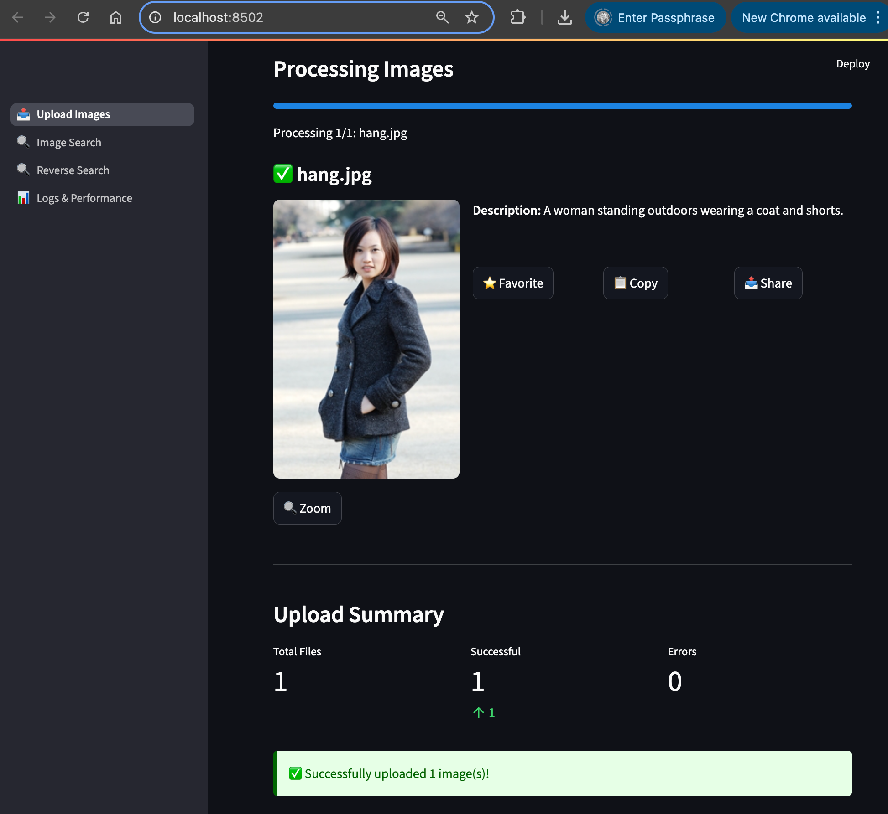

# Image Search
A local image search engine using Ollama, LangChain, and Streamlit. This image search engine can search images using text queries or perform reverse image searches by uploading an image to find similar results.

# Pre-requisites
Install Ollama on your local machine from the [official website](https://ollama.com/). And then pull the Llava model:

```bash
ollama pull llava:34b
```

And then also pull the llama model:

```bash
ollama pull llama3.2
```

## Setup Python Environment

Create a virtual environment named `.venv`:

```bash
python -m venv .venv
```

Activate the virtual environment:

```bash
source .venv/bin/activate
```

Install the dependencies using pip:

```bash
pip install -r requirements.txt
```

## Run

Run the Streamlit app:

```bash
streamlit run app.py
```

# Screenshot 



# Image Search Profiling 

```
2025-06-25 12:54:26,284 - ImageSearchApp - INFO - Image Search - Query: 'test query' | Requested: 5 | Found: 3 | Time: 0.1234s
✅ Search logging test completed
Testing upload operation logging...
2025-06-25 12:54:26,285 - ImageSearchApp - INFO - Image Upload - File: 'test_image.jpg' | Time: 2.5678s | Status: SUCCESS
2025-06-25 12:54:26,285 - ImageSearchApp - ERROR - Image Upload - File: 'bad_image.jpg' | Time: 0.1234s | Status: FAILED
✅ Upload logging test completed
Testing reverse search operation logging...
2025-06-25 12:54:26,285 - ImageSearchApp - INFO - Reverse Search - Image: 'reference_image.jpg' | Found: 4 | Time: 1.8765s
✅ Reverse search logging test completed
\n==================================================
LOG FILES GENERATED:
==================================================
\n📝 Main Log File (./logs/image-search.log):
----------------------------------------
2025-06-25 12:54:25,268 - ImageSearchApp - INFO - Image Search Application started
2025-06-25 12:54:25,268 - ImageSearchApp - INFO - Testing info message
2025-06-25 12:54:25,268 - ImageSearchApp - WARNING - Testing warning message
2025-06-25 12:54:25,268 - ImageSearchApp - ERROR - Testing error message
2025-06-25 12:54:25,268 - ImageSearchApp - INFO - Started: test_function
2025-06-25 12:54:26,282 - ImageSearchApp - INFO - Completed: test_function - Execution time: 1.0056 seconds
2025-06-25 12:54:26,284 - ImageSearchApp - INFO - Image Search - Query: 'test query' | Requested: 5 | Found: 3 | Time: 0.1234s
2025-06-25 12:54:26,285 - ImageSearchApp - INFO - Image Upload - File: 'test_image.jpg' | Time: 2.5678s | Status: SUCCESS
2025-06-25 12:54:26,285 - ImageSearchApp - ERROR - Image Upload - File: 'bad_image.jpg' | Time: 0.1234s | Status: FAILED
2025-06-25 12:54:26,285 - ImageSearchApp - INFO - Reverse Search - Image: 'reference_image.jpg' | Found: 4 | Time: 1.8765s
\n⏱️ Timing Log File (./logs/image-search-timing.log):
----------------------------------------
2025-06-25T12:53:57.872774 | image_description_generation | 9.1497s | SUCCESS
2025-06-25T12:54:00.318754 | image_upload | 11.5959s | SUCCESS
2025-06-25T12:54:00.319510 | image_upload | 11.5970s | SUCCESS
2025-06-25T12:54:26.283162 | test_function | 1.0056s | SUCCESS
2025-06-25T12:54:26.284870 | image_search_query | 0.1234s | SUCCESS
2025-06-25T12:54:26.285163 | image_upload | 2.5678s | SUCCESS
2025-06-25T12:54:26.285276 | image_upload | 0.1234s | FAILED
2025-06-25T12:54:26.285378 | reverse_image_search | 1.8765s | SUCCESS
\n===============================================
```