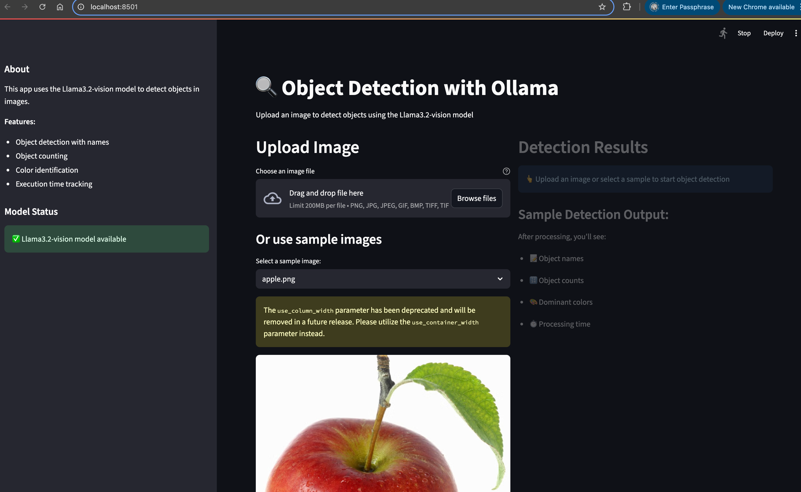
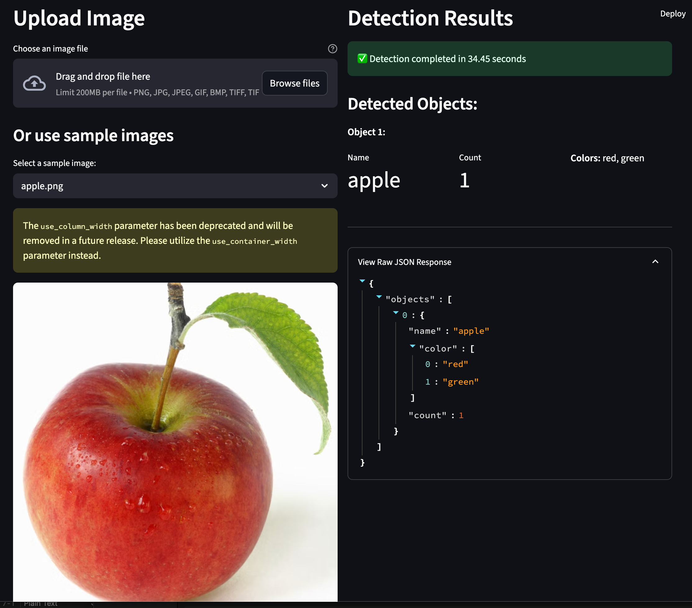

# Object Detection

An advanced object detection project using Ollama's vision models to automatically detect and analyze objects in images. The system provides structured output with detailed information about detected objects including their names, counts, and dominant colors.

## Features

- **Automatic Image Processing**: Automatically processes all images in the `images/` folder
- **Structured JSON Output**: Returns well-formatted JSON responses using Pydantic models
- **Comprehensive Logging**: Logs execution details, timing, and results to both file and console
- **Multiple Format Support**: Supports PNG, JPG, JPEG, GIF, BMP, and TIFF image formats
- **Detailed Object Analysis**: For each detected object, provides:
  - Object name (e.g., 'cat', 'car', 'person')
  - Count of instances in the image
  - Dominant colors of the object
- **Error Handling**: Robust error handling with detailed logging
- **Performance Tracking**: Measures and logs execution time for each image

## Pre-requisites

Install Ollama on your local machine from the [official website](https://ollama.com/). And then pull the llama vision model:

```bash
ollama pull llama3.2-vision
```

Install the dependencies using pip:

```bash
pip install -r requirements.txt
```

## Configuration

Simply add your image files to the `images/` folder. The system automatically detects and processes all supported image formats:

- PNG (.png)
- JPEG (.jpg, .jpeg)
- GIF (.gif)
- BMP (.bmp)
- TIFF (.tiff)

No manual configuration of file names is required - the script will automatically find and process all images in the folder.

## Usage

Run the object detection script:

```bash
python object_detection.py
```

The script will:

1. **Scan** the `images/` folder for all supported image files
2. **Process** each image using the Ollama vision model
3. **Generate** structured JSON output with object details
4. **Log** all activities and execution times to `logs/object_detection.log`
5. **Display** results in the console with detailed formatting

## Output

For each detected object, you'll receive:

```json
{
  "objects": [
    {
      "name": "cat",
      "color": ["black", "white"],
      "count": 2
    },
    {
      "name": "car",
      "color": ["red"],
      "count": 1
    }
  ]
}
```

## Logging

All execution details are logged to `logs/object_detection.log`, including:

- Processing start/end times
- Execution duration for each image
- Success/failure status
- Error details if any issues occur
- Complete model responses

## Screenshots

 
