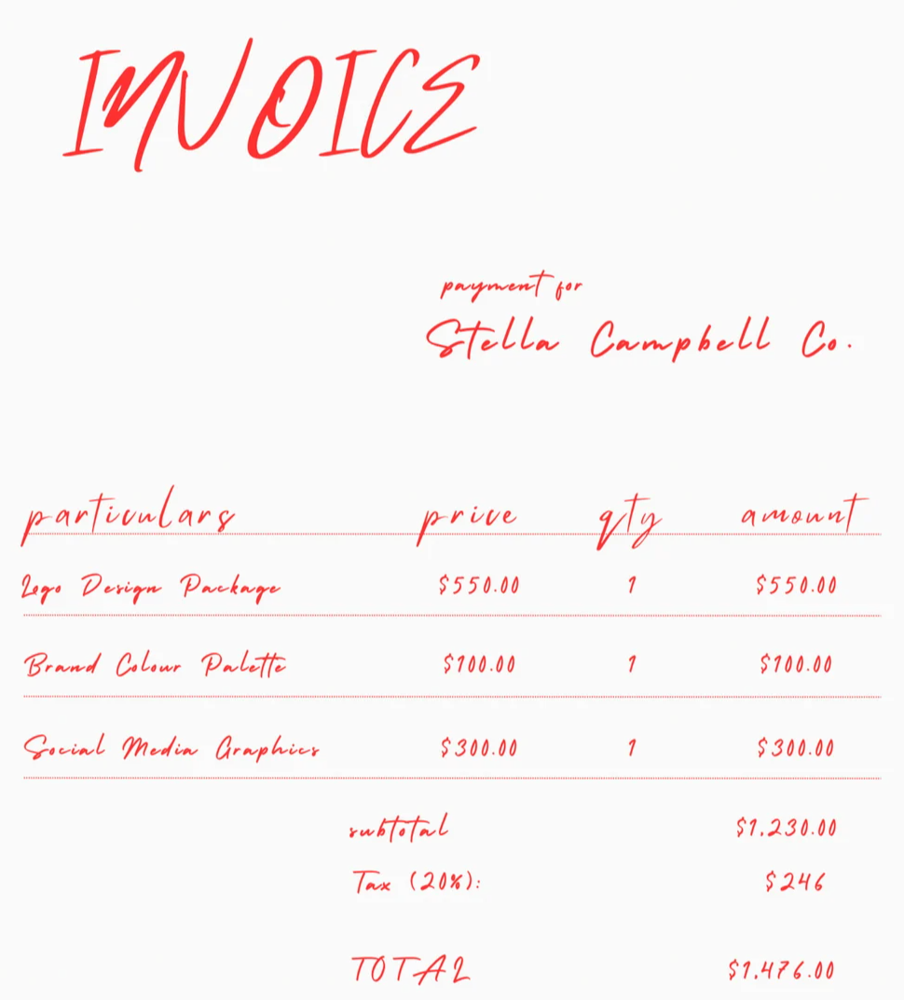
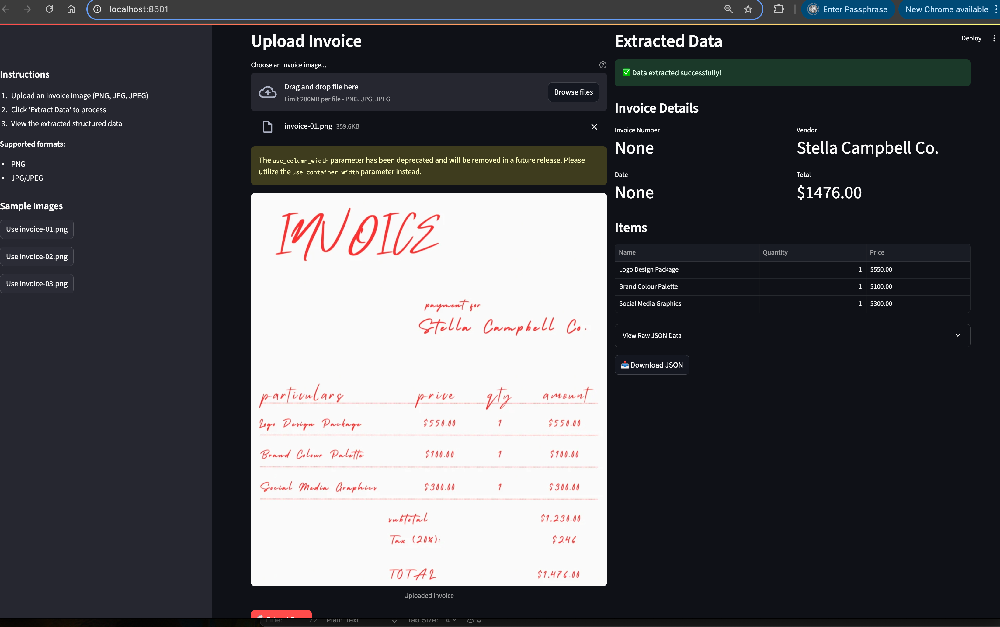

# OCR (Optical Character Recognition)
A simple OCR project using Ollama's vision models to extract text from invoices, receipts, etc.

This project includes:
- A command-line script (`invoice_text_extractor.py`) for basic invoice text extraction
- A Streamlit web app (`app_invoice_text_extractor.py`) for interactive invoice processing
- An enhanced extractor (`invoice_ocr_processor.py`) with comprehensive logging and batch processing
- **NEW**: Python logging and OCR processing time profiling with log file output

## Features

### Core Features

- Extract invoice/receipt numbers
- Parse transaction dates
- Identify vendor names
- List items with quantities and prices
- Calculate totals
- Export structured data as JSON

### Logging & Profiling Features ✨

- **Comprehensive Logging**: All processing steps are logged with timestamps
- **Performance Profiling**: OCR processing time measurement for each image
- **Log File Output**: Logs saved to `./logs/invoice_text_extractor.log`
- **Console & File Output**: Logs displayed in console and saved to file
- **Batch Processing**: Process multiple images with timing statistics
- **Error Handling**: Detailed error logging with processing time information

## Pre-requisites
Install Ollama on your local machine from the [official website](https://ollama.com/). And then pull the llama vision model:

```bash
ollama pull llama3.2-vision
```

## Python Virtual Environment Setup
Create a Python virtual environment named `.venv` to isolate project dependencies:

```bash
# Create virtual environment
python -m venv .venv

# Activate virtual environment
# On macOS/Linux:
source .venv/bin/activate

# On Windows:
# .venv\Scripts\activate
```

Install the dependencies using pip:

```bash
pip install -r requirements.txt
```

**Note:** Make sure to activate the virtual environment every time you work on this project. You can deactivate it by running `deactivate` when you're done.

## Usage

### Option 1: Command Line Script

Add your invoice in the [images](images) folder, and make sure you replace the `your_file.jpg` with your invoice name in the [invoice_text_extractor.py](invoice_text_extractor.py) file.

Run the script:

```bash
python invoice_text_extractor.py
```

### Option 2: Streamlit Web App (Recommended)

Launch the interactive web application:

```bash
streamlit run app_invoice_text_extractor.py
```

Or use the provided script:

```bash
chmod +x run_app.sh
./run_app.sh
```

The Streamlit app provides:
- **File Upload**: Upload invoice images directly through the web interface
- **Sample Images**: Use pre-loaded sample invoices from the images folder
- **Interactive Results**: View extracted data in a structured format
- **JSON Export**: Download extracted data as JSON
- **Real-time Processing**: See results immediately after upload

### Usage Scripts

### Option 1: Command Line Script (With Logging)

```bash
python invoice_text_extractor.py
```

This will process `images/invoice-01.png` and create logs in `./logs/invoice_text_extractor.log`

### Option 2: Enhanced Extractor (Batch Processing)

```bash
python invoice_ocr_processor.py
```

Features:
- Process single images or entire directories
- Comprehensive logging with performance metrics
- Batch processing statistics
- JSON export of results

### Option 3: Quick Demo

```bash
python demo_invoice_extractor.py
```

Shows a quick demonstration of the logging and profiling features.

### Option 4: Streamlit Web App (Recommended)

```bash
streamlit run app_invoice_text_extractor.py
```

Or use the provided script:

```bash
chmod +x run_app.sh
./run_app.sh
```

## Logging Output Example

```log
2025-06-25 15:59:16,359 - __main__ - INFO - Starting invoice OCR text extraction
2025-06-25 15:59:16,359 - __main__ - INFO - Processing image: images/invoice-01.png
2025-06-25 15:59:20,549 - __main__ - INFO - OCR processing completed in 4.19 seconds
2025-06-25 15:59:20,549 - __main__ - INFO - Extracted invoice data successfully
2025-06-25 15:59:20,549 - __main__ - INFO - Invoice text extraction process finished
```

## Key Libraries

This project uses several important Python libraries:

- **Ollama**: A local AI model runner that enables running large language models (including vision models like llama3.2-vision) locally on your machine. Used for the core OCR and text extraction functionality.

- **Pydantic**: A data validation library that uses Python type annotations to validate, serialize, and deserialize data. Ensures structured and validated output from the OCR processing.

- **Streamlit**: A web framework for creating interactive data applications. Powers the user-friendly web interface for uploading and processing invoice images.

- **Pillow (PIL)**: The Python Imaging Library for opening, manipulating, and saving image files. Handles image processing and format conversion for the uploaded invoice images.

## How It Works

This OCR system leverages Ollama's vision-capable language models to extract structured data from invoice images:

1. **Image Processing**: Invoice images are loaded and preprocessed using Pillow to ensure optimal format and quality for analysis.

2. **Vision Model Analysis**: The llama3.2-vision model analyzes the image content, understanding both text and visual layout to identify key invoice elements like headers, line items, and totals.

3. **Structured Extraction**: Using carefully crafted prompts, the AI model extracts specific data points including:
   - Invoice/receipt numbers
   - Vendor information
   - Transaction dates
   - Itemized products/services with quantities and prices
   - Tax amounts and totals

4. **Data Validation**: Pydantic models ensure the extracted data follows a consistent structure and validates data types, making the output reliable for further processing.

5. **Output Generation**: Results are presented in both human-readable format and structured JSON, enabling easy integration with other systems or manual review.

This approach combines the power of modern vision language models with robust data validation to create an accurate and reliable invoice processing system.

## OCR Results Example



```bash 
invoice_text_extractor.py
```

```json
{
  "invoice_number": "None",
  "date": "None",
  "vendor_name": "Stella Campbell Co.",
  "items": [
    {
      "name": "Logo Design Package",
      "quantity": 1,
      "price": 550.0
    },
    {
      "name": "Brand Colour Palette",
      "quantity": 1,
      "price": 100.0
    },
    {
      "name": "Social Media Graphics",
      "quantity": 1,
      "price": 300.0
    }
  ],
  "total": 1476.0
}
```

```
Users/vuhung/Desktop/ollama-playground/ocr/invoice_ocr_processor.py
2025-06-25 16:21:06,264 - __main__ - INFO - Initialized InvoiceExtractor with model: llama3.2-vision
2025-06-25 16:21:06,264 - __main__ - INFO - Starting OCR extraction for: images/invoice-01.png
2025-06-25 16:21:40,598 - httpx - INFO - HTTP Request: POST http://127.0.0.1:11434/api/chat "HTTP/1.1 200 OK"
2025-06-25 16:21:40,599 - __main__ - INFO - OCR processing completed in 34.33 seconds for images/invoice-01.png
2025-06-25 16:21:40,599 - __main__ - INFO - Successfully extracted data: Invoice #None, Vendor: Stella Campbell Co., Total: $1476.00
Single image processing time: 34.33 seconds
Extracted data: {
  "invoice_number": "None",
  "date": "None",
  "vendor_name": "Stella Campbell Co.",
  "items": [
    {
      "name": "Logo Design Package",
      "quantity": 1,
      "price": 550.0
    },
    {
      "name": "Brand Colour Palette",
      "quantity": 1,
      "price": 100.0
    },
    {
      "name": "Social Media Graphics",
      "quantity": 1,
      "price": 300.0
    }
  ],
  "total": 1476.0
}
2025-06-25 16:21:40,599 - __main__ - INFO - Found 3 image files in images
2025-06-25 16:21:40,599 - __main__ - INFO - Starting OCR extraction for: images/invoice-01.png
2025-06-25 16:21:44,442 - httpx - INFO - HTTP Request: POST http://127.0.0.1:11434/api/chat "HTTP/1.1 200 OK"
2025-06-25 16:21:44,443 - __main__ - INFO - OCR processing completed in 3.84 seconds for images/invoice-01.png
2025-06-25 16:21:44,444 - __main__ - INFO - Successfully extracted data: Invoice #None, Vendor: Stella Campbell Co., Total: $1476.00
2025-06-25 16:21:44,444 - __main__ - INFO - Starting OCR extraction for: images/invoice-02.png


2025-06-25 16:22:16,862 - httpx - INFO - HTTP Request: POST http://127.0.0.1:11434/api/chat "HTTP/1.1 200 OK"
2025-06-25 16:22:16,863 - __main__ - INFO - OCR processing completed in 32.42 seconds for images/invoice-02.png
2025-06-25 16:22:16,863 - __main__ - INFO - Successfully extracted data: Invoice #Invoice 001, Vendor: ABC Inc., Total: $5000.00
2025-06-25 16:22:16,863 - __main__ - INFO - Starting OCR extraction for: images/invoice-03.png
2025-06-25 16:22:56,501 - httpx - INFO - HTTP Request: POST http://127.0.0.1:11434/api/chat "HTTP/1.1 200 OK"
2025-06-25 16:22:56,502 - __main__ - INFO - OCR processing completed in 39.64 seconds for images/invoice-03.png
2025-06-25 16:22:56,502 - __main__ - INFO - Successfully extracted data: Invoice #None, Vendor: Robert Koetter, Total: $4024.42
2025-06-25 16:22:56,502 - __main__ - INFO - Batch processing completed: 3/3 successful extractions in 75.90 seconds
2025-06-25 16:22:56,503 - __main__ - INFO - Results saved to extraction_results.json

Batch Processing Summary:
- Total images processed: 3
- Total processing time: 75.90 seconds
- Average time per image: 25.30 seconds
- invoice-01.png: Stella Campbell Co. - $1476.00 (3.84s)
- invoice-02.png: ABC Inc. - $5000.00 (32.42s)
- invoice-03.png: Robert Koetter - $4024.42 (39.64s)
```

## Screenshots

