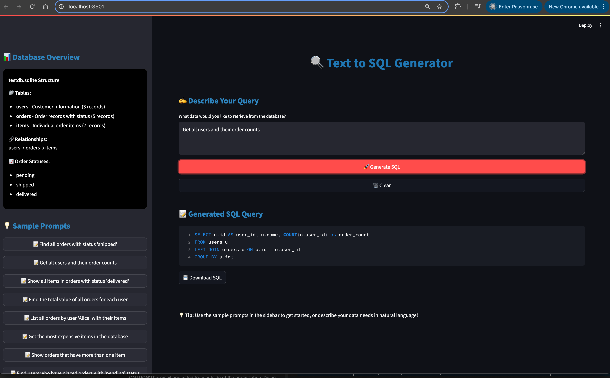

# Text to SQL
A simple Text to SQL converter using Deepseek that connects to your database, reads the schema, and generates SQL queries based on the user's input.

You can watch the video on how it was built on my [YouTube](https://youtu.be/kem-v9MXuG4).

# Pre-requisites
Install Ollama on your local machine from the [official website](https://ollama.com/). And then pull the Deepseek model:

```bash
ollama pull deepseek-r1:8b
```

Install the dependencies using pip:

```bash
pip install -r requirements.txt
```
To use your own database instead of the test SQLite one, just replace your own connection URL into the `db_url` variable in the code.
```python
db_url = "sqlite:///testdb.sqlite"
```

# Run
Run the Streamlit app:

```bash
streamlit run text_to_sql.py
```

## Sample Prompts

Once the app is running, you can try these sample prompts to test the text-to-SQL conversion:

### Basic Queries

- "Show me all users"
- "Get all orders"
- "List all items with their prices"

### Filtering and Conditions

- "Find all orders with status 'shipped'"
- "Show me items that cost more than $5"
- "Get orders for user Alice"

### Joins and Relationships

- "Show me all orders with the user names"
- "List all items in pending orders"
- "Find all users who have placed orders"

### Aggregations and Analytics

- "Count how many orders each user has placed"
- "What's the total value of all items?"
- "Show the average price of items"
- "Count orders by status"

### Complex Queries

- "Show me users and their total spending"
- "Find the most expensive item in each order"
- "List users who have never placed an order"
- "Get the total number of items per order"

These prompts will be converted to SQL queries that work with the sample database containing users, orders, and items tables.

# Screenshot

